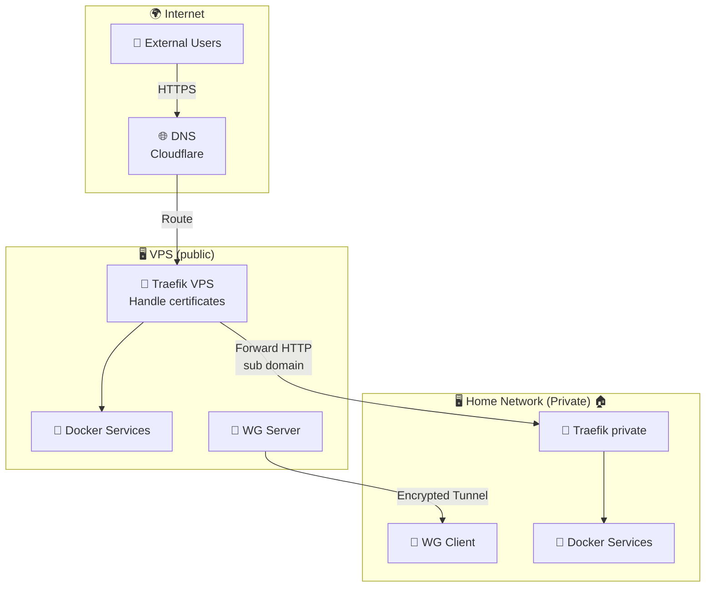

# Homelab Architecture

```mermaid
graph TD
    subgraph internet["🌍 Internet"]
        users["👤 External Users"]
        dns["🌐 DNS<br/>Cloudflare"]
    end
    
    subgraph vps["🖥️ VPS (public)"]
        traefik_vps["🔀 Traefik VPS <br/>Handle certificates"]
        docker_stacks["🐳 Docker Services"]
        wg_server["🔐 WG Server"]
    end
    
    subgraph home["🖥️ Home Network (Private) 🏠"]
        wg_client["🔐 WG Client"]
        traefik_private["🔀 Traefik private"]
        docker_private_stacks["🐳 Docker Services"]
    end
    
    users -->|HTTPS| dns
    dns -->|Route| traefik_vps
    traefik_vps --> docker_stacks
    wg_server -->|Encrypted Tunnel| wg_client
    traefik_vps -->|Forward HTTP<br/>sub domain| traefik_private
    traefik_private --> docker_private_stacks
```
