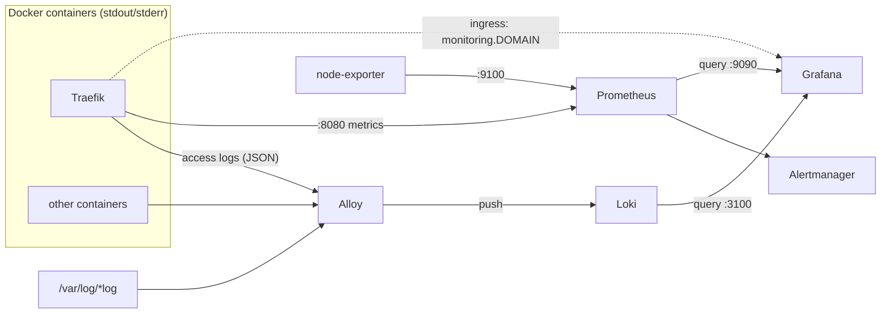

# Monitoring

## Dashboards

Import dashboards https://grafana.com/grafana/dashboards

## Notifications

in [./playbooks/roles/20_n8n](./playbooks/roles/20_n8n) there's a workflow that creates a webhook to send matrix messages,

